# GroeimetAI Data Flow Diagrams

## Overview

This document illustrates the data flow patterns across different system components and user interactions within the GroeimetAI platform.

## 1. User Authentication Flow

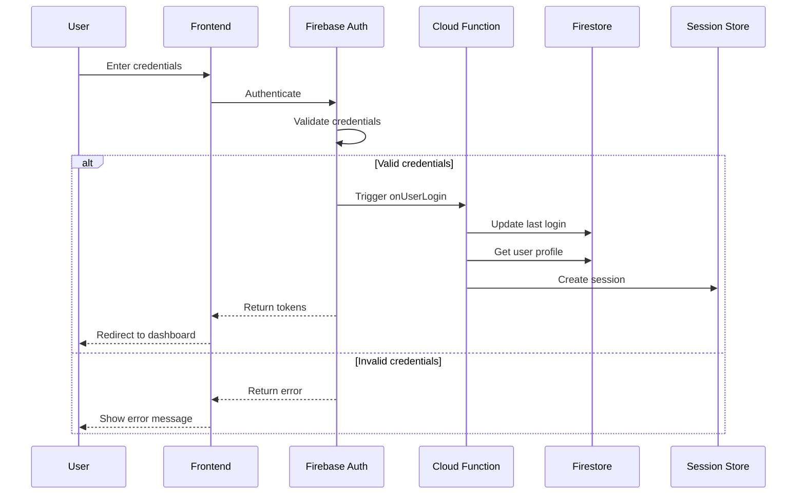

## 2. AI Consultation Data Flow

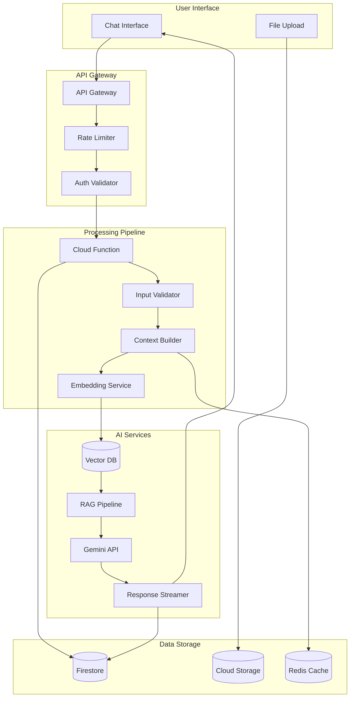

## 3. Real-time Messaging Flow

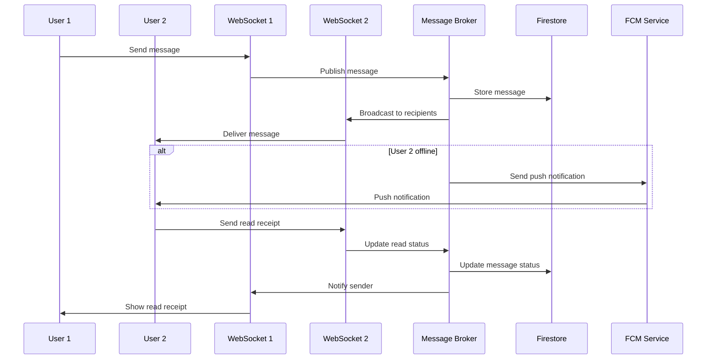

## 4. Project Management Flow

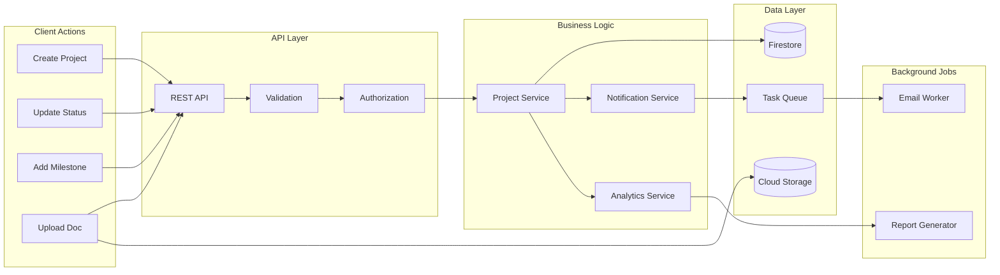

## 5. Payment Processing Flow

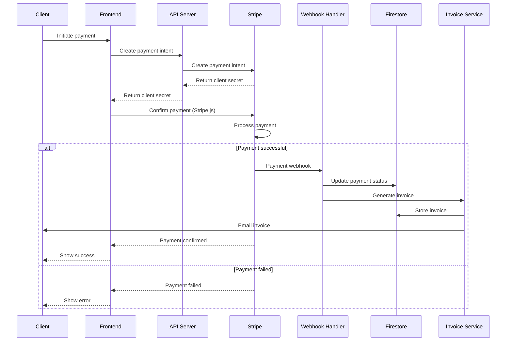

## 6. Document Processing Pipeline

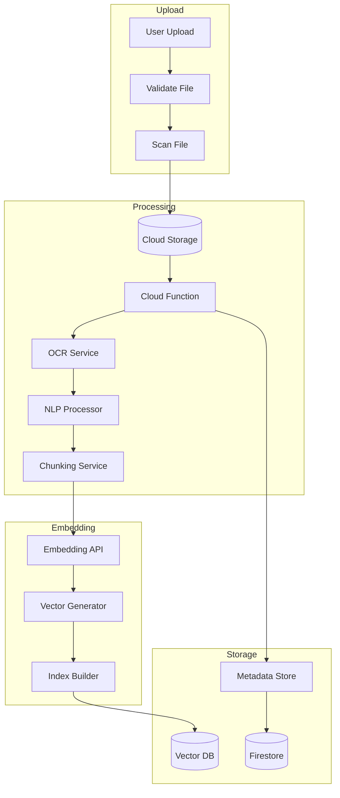

## 7. Analytics Data Flow

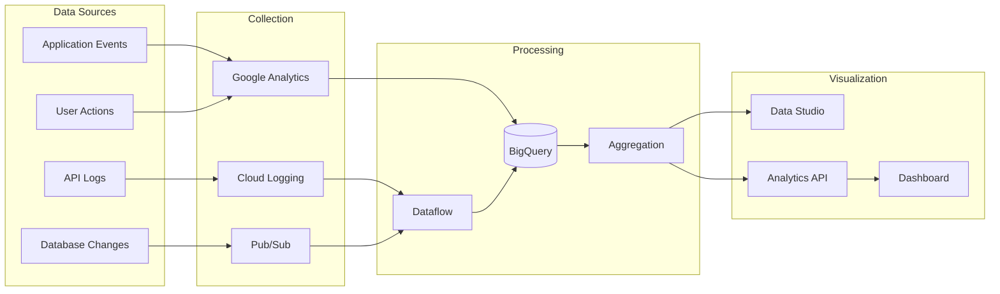

## 8. User Onboarding Flow

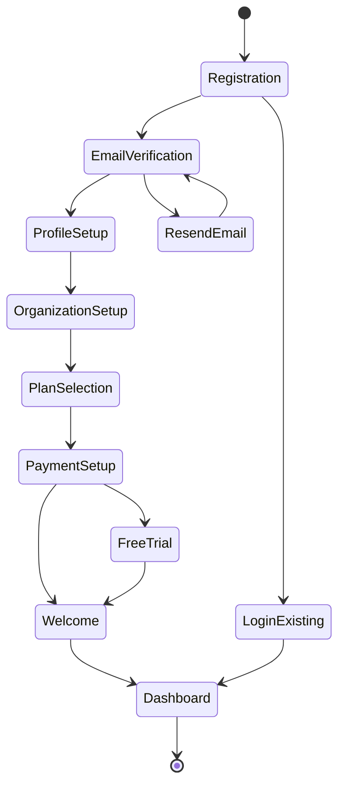

## 9. Content Delivery Flow

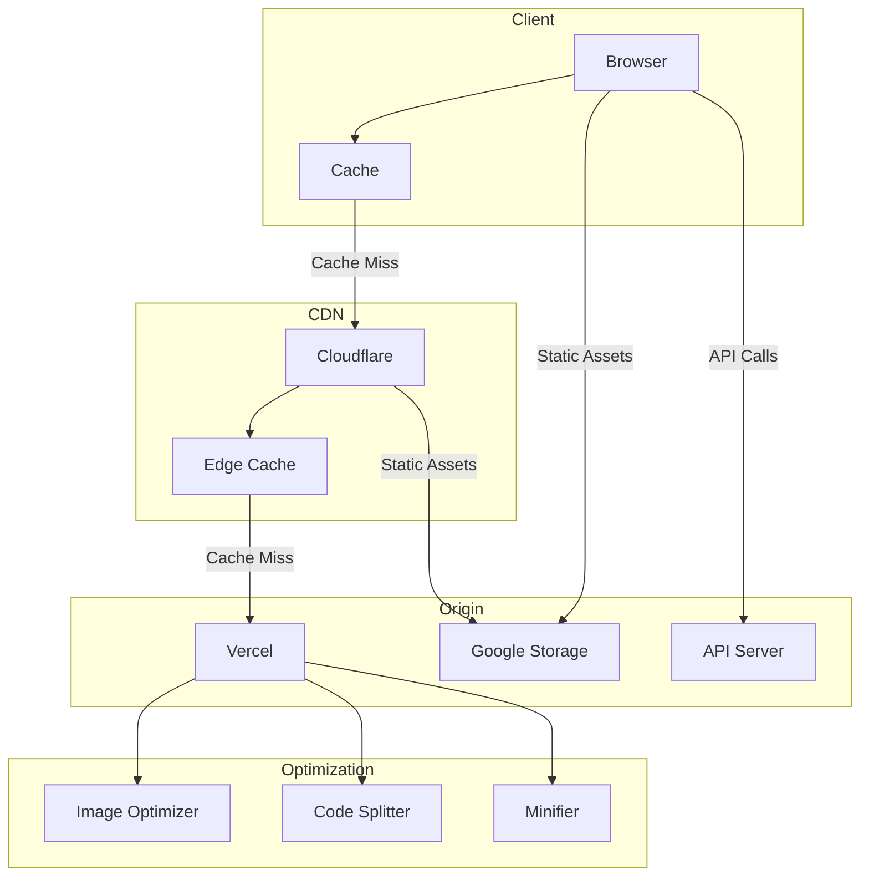

## 10. Error Handling Flow

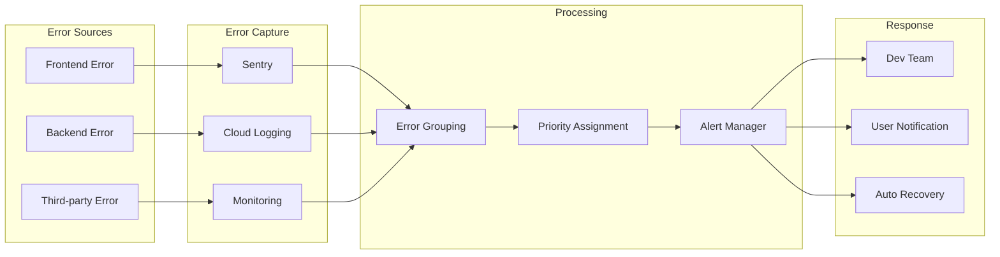

## 11. Search and Discovery Flow

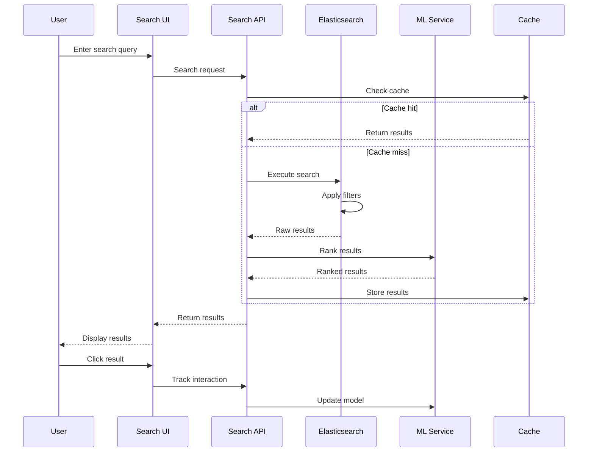

## 12. Backup and Recovery Flow

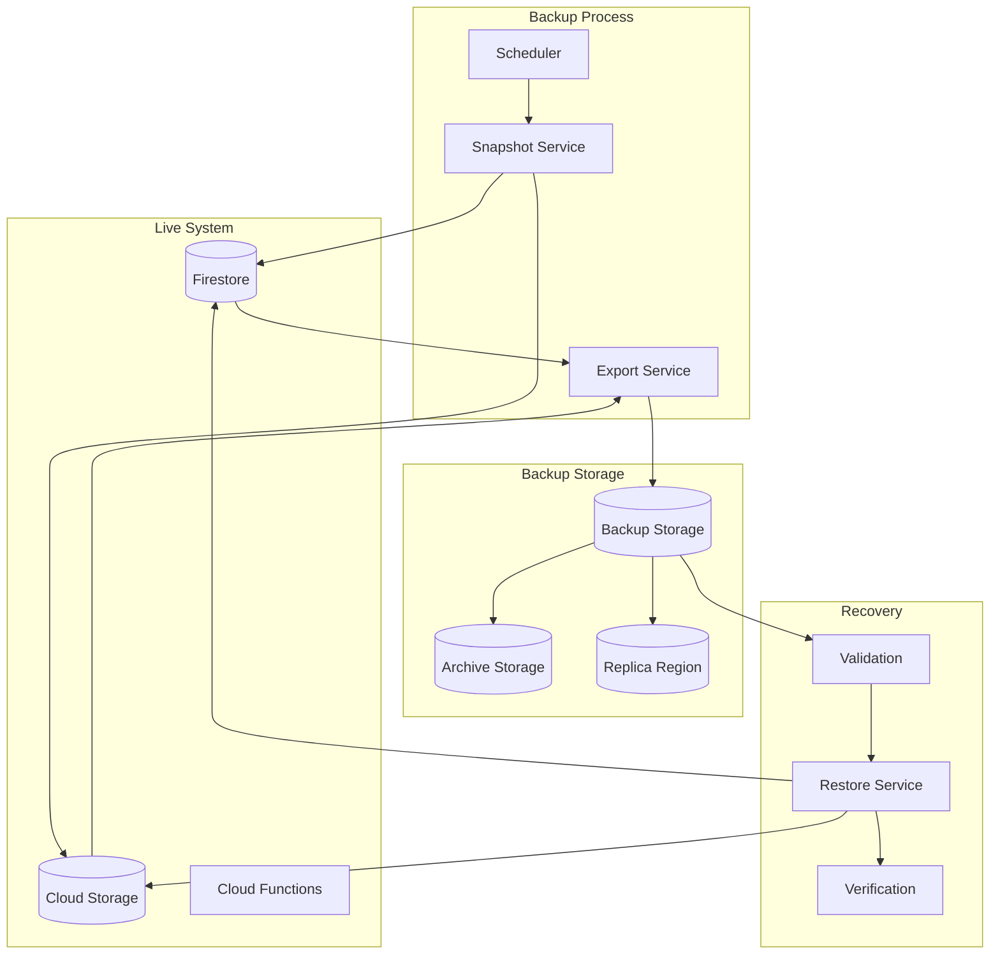

## Data Flow Security Considerations

### 1. Encryption Points

- All data encrypted in transit (TLS 1.3)
- Sensitive fields encrypted at application level
- Encryption keys rotated quarterly

### 2. Access Control

- Each data flow authenticated and authorized
- Service accounts with minimal permissions
- Audit logging at every access point

### 3. Data Validation

- Input validation at entry points
- Schema validation for data transformations
- Output sanitization before display

### 4. Monitoring

- Real-time monitoring of data flows
- Anomaly detection for unusual patterns
- Automatic alerting for failures

## Performance Optimization

### 1. Caching Strategy

- CDN caching for static assets
- Redis caching for frequently accessed data
- Browser caching with proper headers

### 2. Data Compression

- Gzip compression for API responses
- Image optimization and WebP conversion
- Minification of JavaScript and CSS

### 3. Lazy Loading

- Progressive data loading
- Pagination for large datasets
- On-demand resource loading

### 4. Connection Pooling

- Database connection pooling
- HTTP/2 multiplexing
- WebSocket connection reuse
