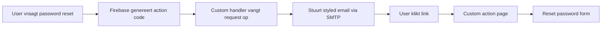

# Custom Styled Firebase Auth Emails

Deze guide legt uit hoe je Firebase Auth emails vervangt met custom styled emails die matchen met je website design.

## Overzicht

Er zijn twee opties voor email styling:

### Optie 1: Firebase Console (Beperkt)
- ✅ Makkelijk te implementeren
- ✅ Geen code wijzigingen nodig  
- ❌ Beperkte styling mogelijkheden
- ❌ Geen volledige controle over design

### Optie 2: Custom Email Handler (Aanbevolen)
- ✅ Volledige controle over design
- ✅ Consistent met website styling
- ✅ Meertalige ondersteuning
- ❌ Meer implementatie werk

## Optie 1: Firebase Console Setup

1. Ga naar [Firebase Console](https://console.firebase.google.com/project/groeimetai-458417/authentication/emails)

2. Voor elke email template:
   - Klik op de template (Email verificatie, Wachtwoord reset, etc.)
   - Pas het onderwerp aan
   - Gebruik deze HTML template:

```html
<div style="font-family: -apple-system, BlinkMacSystemFont, 'Segoe UI', Roboto, sans-serif;">
  <div style="max-width: 600px; margin: 0 auto; background: #ffffff; border-radius: 8px; overflow: hidden; box-shadow: 0 2px 4px rgba(0,0,0,0.1);">
    <!-- Header -->
    <div style="background: #000000; padding: 30px; text-align: center;">
      
    </div>
    
    <!-- Content -->
    <div style="padding: 40px 30px;">
      <h1 style="color: #000; font-size: 24px; margin-bottom: 20px;">%TITLE%</h1>
      <p style="color: #333; font-size: 16px; line-height: 1.5; margin-bottom: 30px;">%MESSAGE%</p>
      
      <div style="text-align: center; margin: 30px 0;">
        <a href="%LINK%" style="background: #F97316; color: white; padding: 12px 30px; text-decoration: none; border-radius: 6px; font-weight: 600;">%BUTTON%</a>
      </div>
      
      <p style="color: #666; font-size: 14px; margin-top: 30px;">Deze link is 1 uur geldig.</p>
    </div>
    
    <!-- Footer -->
    <div style="background: #f9f9f9; padding: 30px; text-align: center; border-top: 1px solid #e0e0e0;">
      <p style="color: #666; font-size: 12px; margin: 0;">© 2024 GroeimetAI. Alle rechten voorbehouden.</p>
    </div>
  </div>
</div>
```

3. Gebruik deze variabelen in Firebase:
   - `%TITLE%` - Email titel
   - `%MESSAGE%` - Bericht tekst
   - `%LINK%` - Actie link
   - `%BUTTON%` - Button tekst

## Optie 2: Custom Email Handler (Volledig Geïmplementeerd)

### 1. Configureer Firebase om Custom Action URL te gebruiken

In Firebase Console:
1. Ga naar Authentication → Templates
2. Klik op "Customize action URL" onderaan
3. Voer in: `https://groeimetai.io/auth/action`

### 2. De implementatie bestaat uit:

#### A. Custom Email Templates (`/src/lib/email/custom-auth-templates.ts`)
- Volledig styled email templates
- Meertalige ondersteuning (NL/EN)
- Consistent met website design

#### B. Auth Action Handler (`/src/app/[locale]/auth/action/page.tsx`)
- Handelt email verificatie af
- Password reset formulier
- Email recovery bevestiging

#### C. Custom Email API (`/src/app/api/auth/custom-email-handler/route.ts`)
- Vervangt Firebase default emails
- Stuurt custom styled emails

### 3. Hoe het werkt:



### 4. Voordelen Custom Handler:

1. **Volledige Design Controle**
   ```html
   <!-- Je eigen HTML/CSS -->
   <div style="background: linear-gradient(...)">
     <!-- Custom design -->
   </div>
   ```

2. **Meertaligheid**
   ```typescript
   const t = translations[lang];
   subject: t.passwordReset.subject
   ```

3. **Branding Consistency**
   - Zelfde fonts
   - Zelfde kleuren (#F97316)
   - Zelfde layout als website

4. **Extra Features**
   - Custom footers
   - Social media links
   - Tracking pixels
   - A/B testing

## Implementatie Checklist

- [ ] Namecheap SMTP credentials in `.env`
- [ ] GitHub Actions secrets toegevoegd
- [ ] Firebase custom action URL geconfigureerd
- [ ] Email templates getest
- [ ] SPF/DKIM records geconfigureerd

## Testing

Test alle email flows:

```bash
# 1. Test email verificatie
- Maak nieuw account aan
- Check email styling

# 2. Test password reset
- Klik "Wachtwoord vergeten"
- Check email styling
- Test reset formulier

# 3. Test email change
- Wijzig email in account settings
- Check bevestigingsmail
```

## Troubleshooting

### Emails komen niet aan
1. Check SMTP configuratie
2. Controleer spam folder
3. Verifieer SPF/DKIM records

### Styling werkt niet
1. Gebruik inline CSS
2. Test in verschillende email clients
3. Gebruik email testing tools

### Links werken niet
1. Check custom action URL in Firebase
2. Verifieer route configuratie
3. Test met ngrok lokaal

## Email Testing Tools

- [Litmus](https://litmus.com) - Test in alle email clients
- [Mail Tester](https://www.mail-tester.com) - Spam score check
- [Email on Acid](https://www.emailonacid.com) - Rendering tests

## Productie Deployment

1. **Environment Variables**
   ```yaml
   SMTP_HOST: mail.privateemail.com
   SMTP_PORT: 587
   SMTP_USER: ${{ secrets.SMTP_USER }}
   SMTP_PASS: ${{ secrets.SMTP_PASS }}
   ```

2. **Monitoring**
   - Track email open rates
   - Monitor bounce rates
   - Check spam complaints

3. **Backup Plan**
   - Fallback naar Firebase default emails
   - Secondary SMTP provider
   - Error notifications